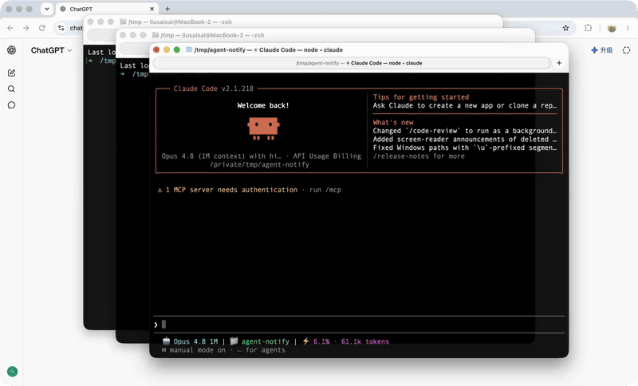

<div align="center">

# Agent Notify

<p align="center"><b>Notifies you when your agent needs you</b>

[](https://go.dev/)
[](https://opensource.org/licenses/MIT)
[](https://github.com/hellolib/agent-notify/releases)

<p align="center"><b>English</b> | <a href="README.zh-CN.md">简体中文</a></p>

</div>

## Overview

Agent Notify hooks into the lifecycle events of AI coding agents (Claude Code, Codex, ZCode, Grok, etc.) and pushes them to your phone and desktop. Get notified the moment your agent needs permission, is waiting for input, finishes a task, or fails — so you never have to babysit a running agent.

Supported delivery channels: **OS-native system notifications**, **Feishu/Lark**, **WeChat Work (企业微信)**, **DingTalk (钉钉)**, **Bark (iOS)**, and **ntfy**.

<p align="center">
  
</p>

## Quick Start

```bash
npx agent-notify
```


## Features

### Supported Channels

| Channel | Description | Setup   |
|:--------|------|---------|
| 🖥️ System Notification | Native notifications on macOS, Linux, and Windows | Default |
|  Feishu / Lark | One-click QR-code binding; push via Feishu bot messages | QR scan |
|  WeChat Work | Push notifications via a WeChat Work group bot webhook | Webhook |
|  DingTalk | Push notifications via a DingTalk group bot webhook | Webhook |
|  Bark | Push to iOS devices via a Bark webhook URL | Webhook |
|  ntfy | Push via ntfy.sh or self-hosted ntfy server | Topic |
|  Slack | Push via Slack Incoming Webhook | Webhook |
|  Discord | Push via Discord channel webhook | 🚧 Webhook |
|  Telegram | Push via Telegram Bot API | 🚧 Bot token |

### Supported Events

| Event | Description | Claude Code | Codex | ZCode | Grok |
|------|------|:---:|:---:|:---:|:----:|
| `permission_required` | Agent needs authorization (e.g. to run a command) | ✅ | ✅ | ✅ |  ✅  |
| `input_required` | Agent is waiting for user input | ✅ | ✅ | — |  ✅  |
| `run_completed` | Task finished | ✅ | — | ✅ |  ✅  |
| `run_failed` | Task failed | ✅ | — | ✅ |  ✅  |

Notes:

- Claude Code subscribes via hooks in `~/.claude/settings.json`: `PermissionRequest`, `Notification`, `Stop`, `PostToolUseFailure`, and `SessionStart`.
- Codex subscribes via `~/.codex/hooks.json`: `PermissionRequest` and `PreToolUse` (with the exact `^request_user_input$` matcher), plus `SessionStart`, mapped to `permission_required` and `input_required`. `Stop` is intentionally not subscribed: Codex emits it whenever an agent turn stops, including after producing a plan that is ready to execute, so it cannot reliably represent `run_completed`. The `input_required` hook requires Codex `>= 0.144.0`; Codex currently has no reliable hook for `run_completed` or `run_failed`.
- **Codex `input_required` is a notification-only MVP.** The Feishu card renders every question, option label, and option description as read-only text. Return to the Codex terminal to submit the answer; the card does not send an answer back to Codex, so no Feishu card callback subscription is required.
- ZCode subscribes via `~/.zcode/cli/config.json`: `SessionStart`, `PermissionRequest`, `PostToolUseFailure`, and `Stop`, mapped to `permission_required`, `run_failed`, and `run_completed`. ZCode has no `Notification` event (so no `input_required`), and its hook schema is strict — an unknown event name will cause the whole hooks config to be silently dropped.
- Grok subscribes via `~/.grok/hooks/agent-notify.json`: `SessionStart`, `Notification`, `Stop`, `StopFailure`, and `PostToolUseFailure`. There is no dedicated `PermissionRequest` event; `Notification`s with permission/approval semantics map to `permission_required` (marked *), others map to `input_required`. `StopFailure` / `PostToolUseFailure` map to `run_failed`.
- **`SessionStart` does not produce a notification.** It is subscribed on every agent solely to capture the terminal window at session start, which powers Linux window-level [Click-to-Focus](#click-to-focus). On macOS/Windows the SessionStart hook is a no-op.

### Supported Platforms

| Platform | Architecture | Status |
|:---:|:---:|:---:|
| macOS | amd64 / arm64 | ✅ |
| Linux | amd64 / arm64 | ✅ |
| Windows | amd64 / arm64 | ✅ |

### Click-to-Focus

System notifications are clickable — clicking one brings you back to the terminal / window where the agent is running. Behavior differs by platform:

- **macOS** — App-level by default (activates the agent's terminal/IDE app). For window-level focus (return to the exact window even when several are open), set `AGENT_NOTIFY_FOCUS_PRECISION=window` in your login shell environment (e.g. `~/.zshrc`); this uses a bundled helper and requires Accessibility permission. Unset stays app-level.
- **Linux (X11)** — Window-level. The exact terminal window is captured at session start (via the `SessionStart` hook) and re-focused on click, so it distinguishes sibling windows of single-process terminals (deepin-terminal, GNOME Terminal, etc.). Native Wayland windows can't be targeted.
- **Windows** — Returns to the terminal window via a bundled helper.

> **`AGENT_NOTIFY_FOCUS_PRECISION`** accepts `window` (window-level) or `app` (app-level — the default). Values are case-insensitive and whitespace-trimmed; anything unset or unrecognized falls back to `app`. This variable **only affects macOS** — Linux is always window-level, and Windows uses its own helper.

Click-to-focus is enabled by default for the System channel; the target app/window is detected automatically from the hook's environment and process tree.


## Configuration

On first run, the launcher downloads the platform-specific binary matching the current npm package version from GitHub Releases and installs it to:

- macOS / Linux: `~/.agent-notify/agent-notify`
- Windows: `~/.agent-notify/agent-notify.exe`

On every subsequent run it checks the local binary version: it downloads if missing, updates if outdated, and otherwise runs directly. The launcher never persistently modifies `PATH` — it always executes via an absolute path.

> **Note**: Codex `>= 0.144.0` integrates through the official hooks system in `~/.codex/hooks.json` and subscribes to `PermissionRequest` and `PreToolUse` (matching only `request_user_input`), plus the notification-silent `SessionStart` hook used for Linux click-to-focus. After installing or updating the hook, run `/hooks` inside Codex to complete the trust review.
>
> **Grok**: Writes `~/.grok/hooks/agent-notify.json`. Global hooks are always trusted; project hooks (`.grok/hooks/`) require `/hooks-trust` or `--trust`. After install, run `/hooks` (or `Ctrl+L`) inside Grok to confirm they loaded.


> You don't need to edit config files by hand — this section is for reference only.

Agent Notify's own config lives at `~/.agent-notify/config.yaml`. **New installs start with all agents and channels disabled** — run `npx agent-notify` (setup wizard) once to enable the agents and channels you want. This avoids showing unconfigured agents as ready in view/doctor after a partial setup. Existing config files are left unchanged.

For Codex `input_required` notifications, use Codex `>= 0.144.0`. New installs include `input_required` in the Codex event choices. An existing configuration with an explicit `notify.codex.events` list is not migrated automatically; run the setup wizard again and select **Agent is waiting for user input** to opt in. Legacy explicit `run_completed` entries are preserved as written, but agent-notify no longer maps Codex `Stop` to that event because `Stop` signals only the end of a turn. The notification shows the questions and options, but answers must still be submitted in the Codex terminal.

Agent integration config locations:

- Claude Code: `~/.claude/settings.json` (writes hooks → command `agent-notify handle-claude-hook`)
- Codex: `~/.codex/hooks.json` (writes hooks → command `agent-notify handle-codex-hook`; run `/hooks` inside Codex to complete trust)
- ZCode: `~/.zcode/cli/config.json` (writes `hooks.events.<Event>` + `hooks.enabled` → command `agent-notify handle-zcode-hook`; restart ZCode for the config to take effect)
- Grok: `~/.grok/hooks/agent-notify.json` (writes hooks → command `agent-notify handle-grok-hook`; project scope uses `.grok/hooks/agent-notify.json`)

### WeChat Work Bot Binding Tip

1. **Create a single-person notification group**: start a group chat in WeChat Work (pull in a few colleagues). After it's created, **do not post anything**, then remove the others — the group becomes your personal notification channel.
2. **Add a bot**: "Group Settings" → "Message Push" → "Add" → "Custom Message Push", name it and save.
3. **Get the webhook URL**: copy the generated URL, which looks like `https://qyapi.weixin.qq.com/cgi-bin/webhook/send?key=xxx`.
4. **Bind it**: run `npx agent-notify`, enable the WeChat Work channel in the setup wizard, and paste the webhook URL.
> Older WeChat Work versions: "Group Settings" → "Group Bots" → "Add Bot" → "New Bot", name it and save.


<p align="center">
  
</p>

## Screenshots

| | |
|:---:|:---:|
|  |  |
| **Setup** | **Feishu Binding** |
|  |  |
| **Feishu Notification** | **WeChat Work Notification** |
|  | |
| **System Notification** | |


## Acknowledgments

Thanks for the support and feedback from the friends at [LINUX DO](https://linux.do/).
